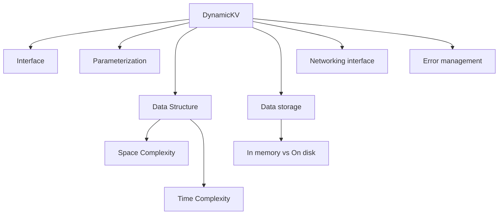
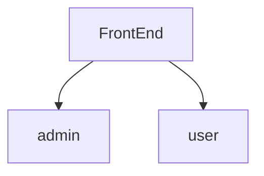

This is a project we are working on for our DBMS project. This include:
1. Aashay Nema (IIT2023082)
2. Bhavya Gupta (IIT2023070)
3. Dhruv Samdhani (IIT2023090)
4. Shaurya Bhandari (IIT2023084)
5. Subhansh Naithani (IIT2023081)

**Project Title:** DynamicKV - A Scalable Web-Based Key-Value Store with Adaptive
Consistency and Real-Time Synchronization

**Description:** 
DynamicKV is a modern NoSQL database system that implements a flexible, high-performance key-value store exposed through a web API. The system is designed to provide a foundation for web applications requiring scalable data storage with tunable consistency guarantees.

**Novelty:** 
1. *Real-time Synchronization Mechanism*
A subscription based system, if a high priority key is changes all the admins will get the notifications.
2. *Intelligent Consistency Controls*
3. *Performance-Optimized Storage Architecture*
Caching of the queries that gets asked many times to save lookup times and store the rest data on the disk.
4. *Enhanced Query Capabilities*
Extend beyond basic CRUD operations by implementing limited query capabilities for values, such as filtering based on JSON fields or range queries on numeric values, without sacrificing the performance benefits of key-value architecture
5. *Machine Learning Integration for API Optimization*
Scope to implement Machine learning for query optimizations

**Limitations of Existing Key-Value Store Solutions:**
1. *Limited Query Flexibility*
Most key-value stores are not optimized for querying beyond exact key lookups. They cannot filter value fields without scanning entire collections, making them inefficient for complex queries

2. *Consistency-Availability Tradeoffs*
Existing distributed key-value stores often struggle with balancing consistency and availability, typically sacrificing one for the other in failure scenarios

3. *Operational Challenges*
Traditional key-value stores lack:
- Rollback capabilities in case of transaction failures
- Standard query languages comparable to SQL
- Optimized support for multiple values within a single key

4. *Performance Under Write-Heavy Workloads*
Many key-value stores struggle with performance degradation under write-intensive workloads due to their architectural design focused on read operations

5. *Limited Data Structure Support*
Most implementations support only simple data formats, lacking native support for complex objects or relationships between data items

**Base paper:** [Amazon's Dynamo - their propetiery key-value based DB solution](https://www.semanticscholar.org/paper/7d906f6632f8740b540ce4d710f53ab0f97cfd5b)

-----
# Database 

**Tech stack:** C/C++, STL containers, WASM (for networking)

---
# Backend

**Tech Stack:** ExpressJS, Websocket, JWT auth, gRPC

The backend will mainly integrate our DB with the frontend. It will include the API restpoints for login, signup, deleting and adding the products.

---
# Frontend

**Tech stack:** React, HTML, CSS, JavaScript, TailwindCSS

Our main focus on frontend is to display the data being affected, namely showing two screens:

### Admin
The admin panel will display all the data, in a list manner. 
admin will have all the rights to delete and add new data too.
### User
the user panel will mainly display the real frontend the user will be interacting with. It will for now have basic user signin and signup.
Further this will be more developed on.

